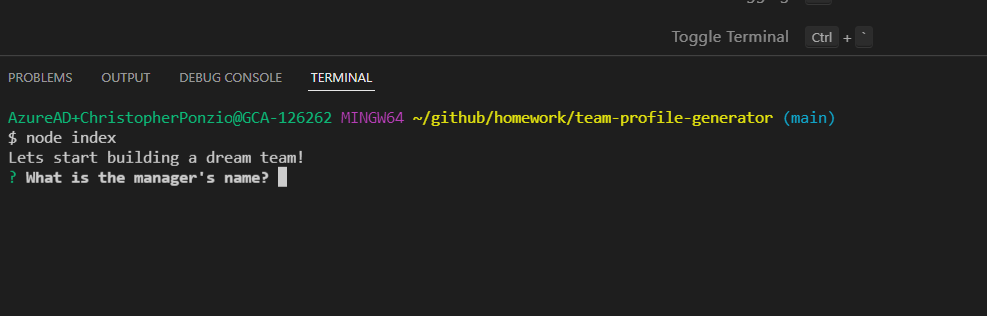
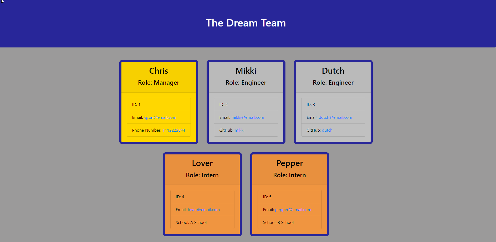

# team-profile-generator

  

  ## Video Link
  https://watch.screencastify.com/v/qKF120toxd90rH6sYeHC
  
  ## Description
  This project was designed to make creating a team roster quick and easy. You can run this application in your Node.js and answer a few questions using the terminal and a team roster with key information will be saved to an HTML file.
  
  ## Installation
  To run this application you need to have Node.js, NPM, and Inquirer.js, Jest.js. 
  * Live URL: https://christopherponzio.github.io/team-profile-generator
  * GitHub: https://github.com/ChristopherPonzio/team-profile-generator
  
  ## Usage
  * To use the Team Profile Generator you need to have Node.js, NPM, Inquirer.js, and Jest.js installed.
  * Once you open the file location in Node.js you can use the command node index to run this application.
  * After you build your team roster using the prompts from the terminal the roster will be saved to an HTML file.
  * 
  * 
  

  ## Credits
  * 1️⃣ Michelle Blackwell github: https://github/Mblackwellgca 
  * 2️⃣ https://stackoverflow.com 
  * 3️⃣ https://w3schools.com 
  * 4️⃣ https://choosealicense.com 
  * 5️⃣ https://img.shields.io
  
  ## License
      Licensed under the MIT license.
  https://choosealicense.com/licenses/mit
  
